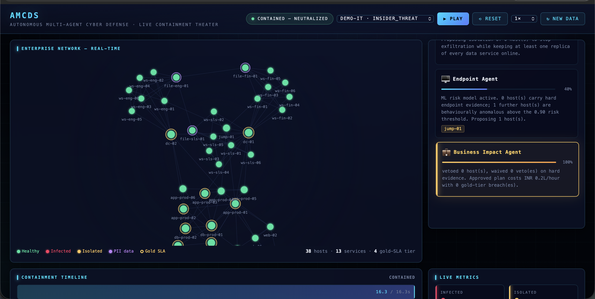
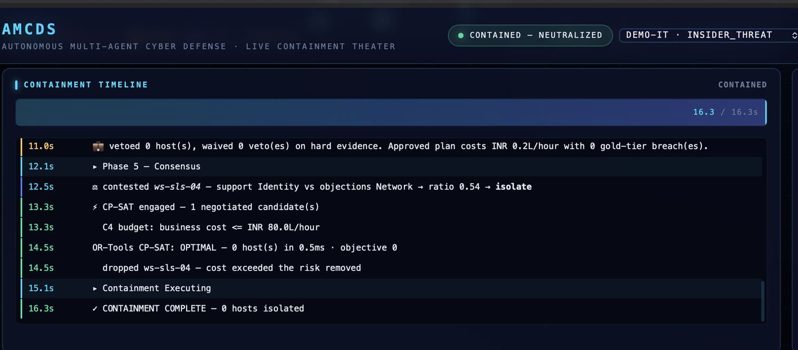
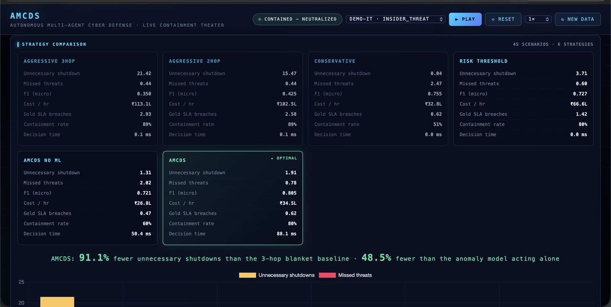
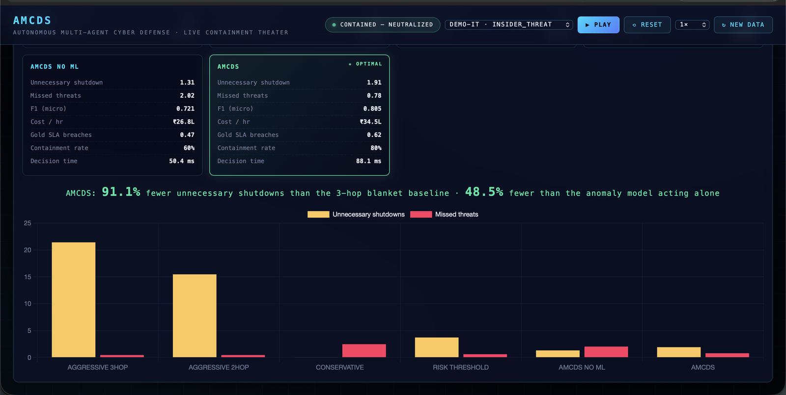

# AMCDS — Project Study Guide

*Everything you need to understand and defend this project, written from first principles.*

This guide describes the implementation as it actually exists. Where something is
simulated, approximate, or not implemented, it says so. Numbers come from
`results/benchmark.json`, produced by `python scripts/run_benchmark.py`.

**Contents**

- Part 1 — [The problem and the idea](#part-1--the-problem-and-the-idea) (§1–3)
- Part 2 — [The agents and the negotiation](#part-2--the-agents-and-the-negotiation) (§4–8)
- Part 3 — [The graph](#part-3--the-graph) (§9–12)
- Part 4 — [The machine learning layer](#part-4--the-machine-learning-layer) (§13–16)
- Part 5 — [The optimizer](#part-5--the-optimizer) (§17–20)
- Part 6 — [Putting it together and measuring it](#part-6--putting-it-together-and-measuring-it) (§21–25)
  — includes **[§21b, the annotated dashboard walkthrough](#21b-seeing-it-happen--the-dashboard-annotated)**: four screenshots explained in detail
- Part 7 — [Honest assessment](#part-7--honest-assessment) (§26–28)

---

# Part 1 — The problem and the idea

## 1. What AMCDS is

AMCDS is a **decision system for attack containment**. Given evidence that a
network has been breached, it decides *which machines to disconnect*.

It does not detect intrusions for a living, it does not run on real networks, and
it never actually unplugs anything. It takes an incident as input and produces a
containment plan as output, along with a complete explanation of how it got there.

The whole system is about 5,100 lines of Python in `amcds/`, with 267 tests in
`tests/amcds/`.

## 2. The cybersecurity problem

An attacker gets onto one machine — a phishing click, a stolen password, a
vulnerable web server. From there they move sideways ("lateral movement"),
collecting credentials and reaching more valuable machines. Industry incident
reports put the time from first foothold to domain-admin access at hours.
Human incident response takes hours too. That is the race.

The defender's tool is **isolation**: cut a machine off the network so the
attacker cannot use it or move through it. Isolation stops the attack. It also
stops the machine from doing its job.

That creates a genuine dilemma:

- **Isolate too much** and you cause an outage. On our reference network the
  standard "isolate everything within 3 hops" playbook takes 27 of 38 machines
  offline. Twenty-one of those were never compromised. Three gold-tier services
  go down.
- **Isolate too little** and the attacker keeps working. Isolating only what is
  *proven* compromised leaves 2.5 compromised machines running per incident and
  fails to contain the attack about half the time.

Existing tooling (SOAR playbooks, EDR auto-containment) picks one side of that
trade with a static rule. AMCDS's contribution is to treat it as a **constrained
optimization problem** where business impact is a first-class input, not an
afterthought.

## 3. Why a multi-agent architecture

You could write one big function that scores every host and picks a threshold.
Three reasons not to:

**Different expertise pulls in different directions, and that is information.**
"Is this host reachable by the attacker?" is a graph question. "Would isolating
it break the payments service?" is a business question. "Does this machine's
behaviour look wrong?" is a statistics question. A single scoring function has to
collapse all of that into one number, and once collapsed you cannot see which
consideration drove the answer. Separate agents keep the reasons separate.

**Disagreement is the useful signal.** If the Network agent wants to isolate a
host and the Endpoint agent objects because nothing on that machine looks wrong,
that conflict is exactly the case a human analyst should see. A single function
would silently average the two and produce a number.

**Authority can be structured.** Because the agents are separate, one of them can
be given a *veto* — a power the others do not have. That is how a business
constraint becomes structural rather than advisory. You cannot express "this one
consideration overrides the others under these conditions" cleanly inside a
weighted sum.

The honest counter-argument, which you should be ready to give: for a problem
this size, a single well-designed scoring function with a good threshold would
get close. The multi-agent structure buys **explainability and structured
authority** more than raw accuracy. The benchmark supports that reading — see §25.

---

# Part 2 — The agents and the negotiation

## 4. The five specialist agents

All five live in `amcds/agents/`. Each implements three methods: `propose`,
`critique`, `counter`.

### Identity agent (`identity_agent.py`)

*Domain: credential theft and privilege escalation.*

Proposes isolating every host with hard evidence (their cached credentials must
be assumed stolen), plus suspected hosts that sit on a credible attack path to a
domain controller or jump host. "Credible" means the most-probable path has trust
≥ 0.20.

Its distinctive move is a **refusal**: it never proposes isolating a domain
controller without hard evidence, and it objects when any other agent does.
Reason: quarantining a DC stops the attacker *and* stops every login in the
organisation. It recommends forced credential rotation instead. It objects to
isolating the jump host on the same grounds — that is how responders reach the
app and identity tiers.

### Network agent (`network_agent.py`)

*Domain: lateral movement containment.*

Works from the trust-weighted attack surface, not a hop count. For every
candidate it asks NetworkX how much of the reachable surface disappears if that
host is cut (`containment_value`).

That measurement is also its critique weapon: a host the attacker cannot
plausibly reach, or whose removal protects nobody, is pure business cost for zero
containment. It objects. This is the main counterweight to agents that
over-propose.

### Data agent (`data_agent.py`)

*Domain: PII and exfiltration.*

Proposes isolating PII-bearing hosts that are reachable from the foothold,
weighted by whether they show outbound-volume anomalies and whether the attack
type goes after data.

Its distinctive critique is the *opposite* of its instinct: it objects when a
proposal would isolate **every replica** of a data service, because that converts
a confidentiality incident into an availability incident. The same rule is
enforced as a hard constraint in CP-SAT (C3).

### Endpoint agent (`endpoint_agent.py`)

*Domain: per-machine behaviour, and the main consumer of the ML layer.*

Proposes hosts with hard evidence, hosts whose calibrated risk score is in the
top 2% most anomalous, and hosts above the 0.90 risk threshold that also have at
least one corroborating detector alert.

It is the **evidence sceptic**. Its critique: if a host has zero detector alerts
and a risk score below the threshold, then whatever the graph says, nothing on
that machine looks wrong, and isolating it is unnecessary downtime. This is the
main mechanism by which the ML layer reduces unnecessary shutdowns — it gives an
agent a principled reason to say *no*.

Turning the ML off (the `AMCDS_NO_ML` ablation) blunts exactly this objection,
which is how the benchmark isolates the ML contribution.

### Business Impact agent (`business_impact_agent.py`)

*Domain: service continuity. Holder of the formal veto.*

Proposes only the hosts that are both proven compromised **and** carry gold-tier
services — a confirmed compromise of the payments database is worse than its
downtime. Everything else it reviews at the veto phase.

Note: it is a specialist like the other four, with a domain of its own. It simply
also holds a power the others do not. "Five specialist agents" is the accurate
description of the roster.

## 5. The negotiation protocol

`amcds/negotiation/protocol.py`. Five phases, each of which can change the answer.

**Phase 1 — PROPOSE.** All five agents independently produce an isolation set,
with a written justification per host and a confidence in [0, 1]. On a typical
incident: 8 hosts in the union, 0 hosts all five agree on.

**Phase 2 — CRITIQUE.** Every agent reviews *every other agent's* proposal — 20
reviews for five agents. Each review records three things per host:
*objections* (should not be isolated, with a reason), *endorsements* (agree),
and *additions* (you missed this one).

The pairwise structure matters. Every objection is attributable to a specific
(critic, target) pair, so the trace can say "Endpoint objected to Network's
proposal of `ws-sls-03`", not just "someone objected".

**Phase 3 — COUNTER.** Each agent gets the critiques aimed at it and revises.
Default policy: concede a host when at least two peers object *and* the agent has
no hard evidence for it; adopt a peer's addition when the agent's own domain
rules accept it. **Hosts with hard evidence are never conceded** — that is the
point of having evidence.

**Phase 4 — VETO.** The Business Impact agent applies its veto to the pooled
candidate set. Struck hosts are removed before the optimizer ever sees them.

**Phase 5 — CONSENSUS.** The surviving conflicts are settled by weighted support:

```
support(h)    = Σ  confidence(a) × weight(a)   over agents a proposing h
opposition(h) = Σ  confidence(a) × weight(a)   over agents a objecting to h
                                                and not proposing h
keep(h)       ⟺   support / (support + opposition)  ≥  0.50
```

Plus: any host with hard evidence is *pinned* in regardless of the vote.

The protocol also reports an **agreement score** — the mean pairwise Jaccard
similarity of the post-counter proposals. It is visible so you can tell whether
the protocol did anything or the agents happened to agree from the start.
Observed values run from 0.41 (real disagreement) to 0.94 (near-consensus).

**Why this is not a set union.** The original version of this project merged
proposals with `set.union()`, which means every agent effectively had a
unilateral veto in the *inclusive* direction and no one could ever object. The
result was the maximum of all proposals. Weighted support means a host one agent
wants and three object to is dropped. There is a test that asserts the final set
is a strict subset of the union when agents disagree.

## 6. The Business Impact veto

The central claim of the project, so it is written as an explicit predicate you
can test:

```
VETO(h)  ⟺  isolating h takes at least one gold-tier service offline
             AND  h has no hard evidence of infection
```

**Formal** means three things:

1. It is absolute. No amount of support from the other four agents unblocks it.
2. It happens *before* optimization. A vetoed host is not in the CP-SAT model, so
   the solver cannot put it back for objective reasons.
3. It is recorded. Every veto carries the rule that fired and the numbers behind
   it. Every *waiver* is recorded too, so you can see the rule was evaluated and
   consciously overridden rather than skipped.

Real output:

```
VETO db-prod-03: isolating it breaks gold-tier service(s) ['customer_data']
(INR 15.0L/hour) and the evidence is only 0.44 confidence (risk 0.04)
— below the hard-evidence bar
```

There is a **second rule**: a ceiling on total hourly revenue impact (default
INR 80 lakh/hour). Hosts without hard evidence are dropped in descending order of
the revenue they cost, until the plan is inside budget. If the hard-evidence
hosts *alone* already exceed the ceiling, the rule reports that it is unattainable
rather than dropping cheap hosts for appearance. (In the earlier version this
budget was computed and then never acted on.)

## 7. Gold-tier SLA

Services carry one of three tiers: `gold`, `silver`, `bronze`. Gold means "an
outage here is a contractual and regulatory event". On the reference network the
gold services are `identity`, `payments`, `customer_data` and `core_banking`.

A service depends on a set of hosts. It is **down** if *any* of its hosts is
offline — the pessimistic series-reliability reading, which is the conservative
choice for a safety rule.

A host's SLA tier is derived, not declared: it is the strictest tier of any
service it carries (`NetworkTopology.finalize()`). So `db-prod-01` is gold
because `payments` and `customer_data` run on it.

Gold status appears in three places: the veto predicate, CP-SAT constraint C2,
and the `sla_breaches` metric.

## 8. Hard evidence of infection

This is the predicate the veto override depends on, so it has to be real.
`amcds/evidence.py`.

The earlier version asked "is this host in `scenario['infected_hosts']`?" — that
is *ground truth*, which a real defender never has. Every claim built on it was
untestable. It is replaced by an explicit evidence ledger.

Each observation is an `Evidence` item with a **fidelity**: how trustworthy that
class of observation is, a property of the detector rather than of one alert.

| Class | Fidelity | Reading |
|---|---|---|
| ransomware canary | 0.97 | high — act on it alone |
| EDR malicious process | 0.94 | high |
| credential dump (LSASS read) | 0.92 | high |
| C2 beacon | 0.88 | high |
| lateral connection | 0.60 | medium — suggestive |
| data exfil volume | 0.58 | medium |
| auth anomaly | 0.55 | medium |
| ML anomaly | 0.40–0.75 | medium, capped below the hard bar |
| malicious URL contact | 0.35 | low — context only |
| peer reputation | 0.20 | low |

```
has_hard_evidence(h)  ⟺  any single item with confidence ≥ 0.85
                       OR  ≥ 2 independent medium signals whose
                           noisy-OR confidence ≥ 0.90
```

Two details make this defensible:

**Noisy-OR, not a sum.** Independent probabilistic signals combine as
`1 − Π(1 − p_i)`. Two 0.60 signals give 0.84 — short of the 0.90 bar. Three give
0.92 — over it. So corroboration works, but slowly, which is correct.

**"Independent" means distinct evidence types.** Ten copies of the same
failed-login alert are one piece of evidence, not ten. There is a test for this.

**The ML model can never confirm on its own.** `ML_MAX_FIDELITY = 0.75 < 0.85`,
asserted at runtime and in the tests. An anomaly detector alone must never be
enough to override a gold-tier SLA. It can be one of several corroborating
signals.

Detection is deliberately imperfect in both directions: sensors miss compromised
hosts (an insider using legitimate credentials trips almost nothing), and they
fire on clean hosts. If detection were an oracle the negotiation would be
pointless, so there is an integration test asserting that both error types occur.

---

# Part 3 — The graph

## 9. The NetworkX model

`amcds/network/topology.py` maintains three structures.

**`self.graph` (`nx.Graph`) — reachability.** An edge means host A can open a
connection to host B. Each edge carries `trust ∈ (0,1]`: the modelled probability
an attacker on A can pivot to B in one step.

| Edge | Trust | Why |
|---|---|---|
| workstation ↔ workstation | 0.85 | flat departmental subnet, SMB/RPC |
| workstation → file server | 0.65 | file share |
| app server → database | 0.45 | service account with a scoped grant |
| workstation → domain controller | 0.10 | Kerberos/LDAP only, hardened |

Trust encodes *exploitability*, not merely whether traffic is allowed. That
distinction is the whole reason the blanket baseline over-isolates: a workstation
can reach the DC, but that does not make the DC one easy hop away.

Each edge also stores `weight = −log(trust)`.

**`self.dep_graph` (`nx.DiGraph`) — service dependency.** A bipartite graph with
`service → host` edges, so `dep_graph.predecessors(host)` answers "what breaks if
this machine goes offline".

**Zones** — `dmz`, `corp`, `app`, `data`, `identity`. Coarse network segments.

The reference network (`amcds/network/builder.py`) has 38 hosts, 104 edges, 13
services, 5 zones and **diameter 5**. The earlier flat topology had diameter 2,
because every workstation touched both domain controllers — which meant a 3-hop
blanket baseline isolated literally every host, making the headline comparison
meaningless. There is a test asserting diameter ≥ 4.

## 10. Reachability

Two different questions, two different algorithms.

**"What can the attacker still touch after we pull these plugs?"** Delete the
isolated hosts from the graph and take the connected component of the sources:

```python
sub = self.graph.subgraph([n for n in self.graph.nodes if n not in excluded])
out |= nx.node_connected_component(sub, source)
```

**"How likely is the attacker to actually get there?"** This is where the trust
weights earn their place. We want the path that maximises the **product** of edge
trusts. Products are awkward for shortest-path algorithms, but:

```
maximise  Π trust_i     ⟺     minimise  Σ −log(trust_i)
```

because `log` is monotonic and turns products into sums. So Dijkstra over
`weight = −log(trust)` finds the maximum-probability attack path, and
`exp(−distance)` recovers the probability.

```python
lengths = nx.single_source_dijkstra_path_length(self.graph, s, weight="weight")
probability = math.exp(-lengths[target])
```

Concretely: `attack_path("ws-fin-01", "db-prod-01")` returns
`['ws-fin-01', 'jump-01', 'app-prod-01', 'db-prod-01']` with probability
**0.047** — a production database is genuinely hard to reach from a finance
workstation, even though it is only three hops away. A hop count cannot express
that. There is a test that enumerates all simple paths and asserts Dijkstra's
answer is the maximum.

`plausible_attack_surface(sources, min_trust=0.05)` returns the hosts reachable
above a probability floor. That is a much tighter set than raw adjacency.

## 11. Blast radius

`blast_radius(sources)` quantifies what an infection threatens, in business terms
rather than host counts:

```python
{
  "n_hosts_at_risk": 21,
  "services_at_risk": ["admin_access", "core_banking", "ecommerce", "identity", ...],
  "gold_services_at_risk": ["core_banking", "identity", "payments"],
  "revenue_at_risk_per_hour": 13610000.0,
  "pii_hosts_at_risk": ["dc-01", "file-eng-01", "file-fin-01"],
}
```

It intersects a hop-bounded neighbourhood with the trust-weighted plausible
surface, so it is neither "everything within k hops" (too broad) nor "only direct
neighbours" (too narrow).

The mirror-image function is `containment_value(isolate, sources)`, which re-runs
the reachability query on the graph *with the isolation set deleted*:

```python
{"surface_before": 25, "surface_after": 0, "reduction_pct": 100.0,
 "hosts_protected": ["app-prod-01", "dc-01", "jump-01", ...]}
```

This is what lets the Network agent say "cutting this host protects 4 downstream
machines" instead of guessing.

Also used: `nx.betweenness_centrality` (how much lateral traffic a host carries),
`nx.articulation_points` (choke points whose loss disconnects the network),
`nx.diameter`.

## 12. Service dependencies

Modelled as the bipartite DiGraph. Two consequences worth knowing:

**Revenue is counted once per downed service, not per host.** Isolating two hosts
of `payments` costs the same as isolating one, because the service is already
down. This matters — the earlier objective summed per-host revenue, which
double-counted every multi-host service and therefore optimised a *different
quantity from the one it was scored on*. There is a regression test.

**Availability is a constraint, not a cost.** "Keep one replica of every
multi-host service online" is enforced (CP-SAT C3, and the Data agent's
critique), not priced into the objective.

---

# Part 4 — The machine learning layer

## 13. Where ML fits, and why it is not a bolt-on

```
telemetry ──► features ──► IsolationForest ──► calibrated risk score
                                                       │
                                                       ▼
                                          ML_ANOMALY evidence item
                                                       │
                                                       ▼
                                        ThreatAssessment ──► agents
```

The ML layer answers **"how unusual is this host's behaviour?"** That is a
different question from "what should we do about it" (agents) and "which plan is
optimal" (CP-SAT). It has a real job: signature sensors miss things, especially
insider threats, and something has to score the hosts that no detector fired on.

Crucially, the ML output is **capped**: it enters as an evidence item with
fidelity at most 0.75, below the 0.85 hard-evidence bar. So it can raise
suspicion and corroborate other signals, but it can never on its own justify
breaking a gold-tier SLA.

## 14. Feature engineering

Two ideas do the work. `amcds/ml/features.py`.

**Peer-group baselining.** A web server making 1,500 outbound connections is
normal. A workstation making 1,500 is not. So every raw counter is turned into a
robust z-score *within its host type*:

```
z = (x − median_type(x)) / (1.4826 × MAD_type(x))
```

MAD is the median absolute deviation; the 1.4826 makes it comparable to a
standard deviation for normally distributed data. Median and MAD are far less
sensitive to outliers than mean and standard deviation, which matters when the
training data has heavy tails by design. Both statistics come from the
**attack-free corpus only**, so no information about the incident leaks into the
normalisation.

This is what real user-and-entity-behaviour-analytics products call peer-group
analytics.

**Behavioural ratios**, computed before normalisation because they only mean
something as ratios:

- `peer_saturation` = distinct peers / graph degree — above 1 means the host
  talked to more machines than its normal reachability set: scanning.
- `bytes_out_per_peer` — bulk transfer concentrated on few peers: exfiltration.
- `conn_per_peer` — many connections to few peers: beaconing or brute force.

**16 features total**: 13 counters (outbound connections, distinct peers,
new-peer ratio, failed auth count, failed auth ratio, distinct destination ports,
bytes out, bytes in, off-hours ratio, admin process launches, file operations per
minute, peer zone diversity, beacon regularity) plus the 3 ratios.

**What is deliberately excluded**: graph features (centrality, degree,
criticality). They are static per host, so an unsupervised model fitted on clean
data would just learn that rare host types are anomalous. They are exposed
separately to the agents and the optimizer instead.

## 15. Anomaly detection and risk scoring

`amcds/ml/risk_model.py`.

**Why IsolationForest and not a classifier.** In a real SOC you do not have
labelled "this host was compromised" data for your own network. You do have
plenty of quiet days. So the model is **unsupervised**: fitted on 60 attack-free
observation windows × 38 hosts = 2,280 rows of clean telemetry, and it never sees
a labelled attack. Every benchmark scenario is therefore genuinely held out, and
the reported metrics are test metrics rather than fit statistics.

IsolationForest works by building random trees that split on random features at
random thresholds. Anomalies get isolated into their own leaf after few splits,
because they sit away from the bulk of the data; normal points need many splits.
The average path length across the forest becomes the anomaly score. It is fast,
handles mixed scales, needs no labels, and — unlike a deep model — you can
explain it in two sentences.

**Calibration is where the design pays off.** `score_samples` returns an
unbounded, model-specific number that means nothing to an agent or an analyst. We
convert it to the **empirical percentile against the benign score distribution**:

```
risk(x) = P_benign( score ≤ score(x) )
```

Two consequences:

1. `risk = 0.97` reads as "only 3% of normal windows looked at least this
   unusual". That is a sentence a human can act on.
2. A benign host's risk is **uniform on [0, 1]**, so **the threshold *is* the
   nominal false-positive rate**. Setting 0.90 means you expect to flag 10% of
   clean hosts. There is a test asserting this empirically.

This is why `ML_SUSPICIOUS_THRESHOLD = 0.90` and not 0.6 — the number means
something specific.

**Interpretability.** Every score comes with the three features with the largest
*positive* z-scores (fewer connections than normal is not evidence of compromise;
far more is):

```
risk 0.99 driven by file_ops_per_min +12.0σ, new_peer_ratio +11.0σ,
admin_process_launches +8.8σ vs peer-group baseline
```

That string is carried into the evidence ledger and into the decision trace.

**Results** (45 scenarios, 1,710 host-windows, 16.7% base rate):

| Metric | Value | Note |
|---|---|---|
| ROC-AUC | 0.943 | threshold-free separability |
| **PR-AUC** | **0.758** | the right summary here; random = base rate, 0.167 |
| Precision @ 0.90 | 0.595 | |
| Recall @ 0.90 | 0.856 | |
| F1 @ 0.90 | 0.702 | |
| Recall @ FPR ≤ 5% | 0.751 | "if the SOC tolerates 5% noise, we catch 75%" |
| Accuracy | 0.879 | **misleading** — see below |

**Why accuracy is reported but not headlined.** At a 16.7% base rate, always
predicting "clean" scores 83.3% while catching nothing. Accuracy is a bad summary
for imbalanced problems. PR-AUC compares directly against the base rate a random
ranker would achieve, so 0.758 against 0.167 is a meaningful 4.5× improvement.

Per attack type the model gets precision 0.72 on ransomware, 0.60 on lateral
movement, and only 0.31 on insider threat — because only ~1.9 of 38 hosts are
compromised there, so even a few false positives dominate. That is a real finding
and it is in the report.

## 16. How ML evidence reaches the agents

`amcds/detection/pipeline.py` fuses two streams into one `ThreatAssessment`:

```
sensor alerts ─────┐
                   ├──► ThreatAssessment ──► NegotiationContext ──► agents
telemetry ─► ML ───┘
```

The risk score is attached to the host's assessment, and if it clears the
threshold an `ML_ANOMALY` evidence item is added with fidelity mapped from the
score onto [0.40, 0.75].

The agents read it three ways:
- **Endpoint agent** uses it directly, both to propose (top 2% anomalous) and to
  object (zero alerts and low risk → nothing looks wrong here).
- **Business Impact agent** cites it in veto text ("risk 0.04").
- **CP-SAT** uses it in the residual-risk weight: an anomalous host left online
  costs more.

Passing `risks=None` produces the `AMCDS_NO_ML` ablation — the agents then see
signature alerts only. That single switch is what makes the ML contribution
measurable rather than assumed.

---

# Part 5 — The optimizer

## 17. Candidate isolation plans

The negotiation does not decide the final plan. It produces a set of
**defensible candidates** — hosts that survived critique, counter, veto and the
consensus vote. Typically 6–13 hosts.

Choosing the best subset of those is a combinatorial problem with structure:
isolating two hosts of one service costs no more than one, gold services must
keep a replica, and there is a budget ceiling. That is a constraint-programming
problem, so it goes to a constraint solver.

## 18. CP-SAT

`amcds/optimization/cpsat_solver.py`, using Google OR-Tools.

CP-SAT is a **constraint programming solver over integers**, built on
SAT-solving technology with linear-programming relaxations. You give it variables
with finite domains, constraints, and an objective; it searches and returns a
solution *proved optimal* (status `OPTIMAL`) or the best found within a time
limit (`FEASIBLE`). On this problem it proves optimality in about 1 ms for 13
variables and stays under 10 ms for all 38.

**Variables**

- `x[h] ∈ {0,1}` — isolate host `h`. One per candidate.
- `d[s] ∈ {0,1}` — service `s` is down, linked by `model.AddMaxEquality(d[s], [x[h] for h in deps])`.

The service indicators are the important modelling choice: they make business
cost count the same way the evaluation metric does.

## 19. The objective function

```
minimise   α · residual_risk  +  β · business_cost

business_cost  = Σ over services      revenue_per_hour[s] · d[s]
residual_risk  = Σ over candidates    risk_weight[h] · (1 − x[h])

risk_weight[h] = criticality[h] · reach[h] · (1 + risk_score[h]) · 500
```

In words: **pay for the services you break, and pay for the risk you leave
behind.**

- `criticality[h]` ∈ 1..5 — how much the host matters.
- `reach[h]` ∈ [0,1] — the most-probable-path trust from the confirmed foothold.
  An unreachable host has weight 0, so leaving it online is free and the solver
  will not isolate it.
- `risk_score[h]` — the ML anomaly score. This is where ML enters the optimizer.

CP-SAT is an integer solver, so both terms are scaled to integers.
`OBJECTIVE_SCALE = 1000` divides revenue (up to 5 million INR → 5,000 units) and
`RISK_UNIT = 500` scales risk (a maximally critical, fully reachable, maximally
anomalous host → 5 × 1 × 2 × 500 = 5,000 units). They land in the same order of
magnitude on purpose, so neither silently dominates. α and β are multiplied by
100 before rounding, so fractional weights survive — the earlier version wrote
`int(self.alpha)`, which turned α = 0.5 into 0 and silently deleted the entire
risk term. There is a regression test.

## 20. The constraints

| | Constraint | Encoding |
|---|---|---|
| **C1** | every host with hard evidence is isolated | `x[h] == 1` |
| **C2** | every gold service keeps one non-evidenced host online | `Σ (1 − x[h]) ≥ 1` over its non-evidenced hosts |
| **C3** | every multi-host service keeps a replica online | same form, all multi-host services |
| **C4** | total business cost ≤ hourly ceiling | `Σ revenue[s]·d[s] ≤ budget` |

C2 and C3 skip a service when *every* host of it has hard evidence — if the whole
service is proven compromised, keeping a replica online is not protecting
anything. They also skip when a non-candidate host of the service exists, since
that host is trivially staying online and the constraint is already satisfied.

C4 is **dropped when C1 alone already exceeds the budget**, and the relaxation is
reported in the result rather than swallowed:

```
"relaxations": ["C4 budget relaxed: hard-evidence hosts alone already cost
                 INR 151.7L/hour, above the INR 80.0L ceiling"]
```

If the model is genuinely infeasible the solver falls back to isolating only the
hard-evidence hosts, which always satisfies C1, and says so.

Every solve returns a plain-language explanation:

```
CP-SAT OPTIMAL: isolated 18 of 19 negotiated candidate(s) at INR 22.9L/hour with
1350 residual-risk units left on the table. Dropped 1 candidate(s) whose business
cost exceeded the risk they removed: app-prod-04. Active constraints:
C1 hard-evidence: 9 host(s) forced to isolate (dc-01, file-eng-01, jump-01,
ws-eng-02, ws-eng-06...); C4 budget: business cost <= INR 80.0L/hour.
```

**A second optimizer, honestly labelled.** `annealing_solver.py` builds the same
problem as a QUBO and solves it with D-Wave's `neal` — a **classical** simulated
annealer on the CPU. Nothing quantum executes. It is kept as a control: CP-SAT
enforces the SLA rule as a *hard constraint*, the annealer as a *penalty term*, so
running both shows what a metaheuristic costs you in constraint satisfaction. An
earlier version of this project called this a "quantum solver"; it was not, and
the name is fixed.

---

# Part 6 — Putting it together and measuring it

## 21. End-to-end execution flow

`amcds/pipeline.py`. One incident, start to finish:

1. **Generate/receive the scenario** — seed hosts, dwell time, sensor alerts,
   behavioural telemetry. Ground truth exists but is walled off for evaluation.
2. **Score** — `HostRiskModel.score(telemetry)` → calibrated risk + drivers.
3. **Fuse** — `build_assessment(alerts, risks)` → `ThreatAssessment`. Derives
   `confirmed` (hard evidence) and `suspected`.
4. **Build context** — `NegotiationContext.build(topology, assessment)`, which
   also computes the blast radius from the confirmed set.
5. **Negotiate** — the five phases → candidate set + full log.
6. **Graph analysis** — `attack_path_probabilities(confirmed)` gives the reach
   values CP-SAT needs.
7. **Optimize** — CP-SAT over the candidates → final plan.
8. **Measure containment** — `containment_value(plan, confirmed)`.
9. **Return** a `ContainmentDecision` carrying every input, intermediate and
   output, with `trace_host(h)` for any machine.

Total wall-clock: about 88 ms per incident.

Real trace for one host:

```
file-eng-01: no detector alerts; ML risk score 0.24. Proposed for isolation by
Network. Objected to by Endpoint. Contested: support 0.85 vs opposition 0.80
(ratio 0.52) -> kept. CP-SAT kept it: leaving it online carried 603
residual-risk units against its share of the business cost. Outcome: ISOLATED.
```

That single string names the evidence, the ML score, the proposing agent, the
objecting agent, the exact vote arithmetic, the optimizer's reasoning, and the
outcome.

## 21b. Seeing it happen — the dashboard, annotated

Run `make dashboard` and open <http://127.0.0.1:8000>. Everything below is a real
run of the `DEMO-IT` (insider threat) scenario, annotated in detail. If you can
narrate these four pictures out loud, you can explain the whole project.

---

### Picture 1 — the network, and the five agents arguing



#### The left half: the company

Each dot is one computer. The naming tells you what it is:

| Prefix | What it is | Why it matters |
|---|---|---|
| `ws-fin-*`, `ws-eng-*`, `ws-sls-*` | staff laptops in Finance, Engineering, Sales | where attacks usually start (someone clicks something) |
| `file-fin-01`, `file-eng-01`, `file-sls-01` | departmental file shares | hold personal data; easy to reach from a laptop |
| `dc-01`, `dc-02` | domain controllers — the login servers | the crown jewels. Own these and you own everything |
| `jump-01` | admin jump host | the bridge from the office network to the servers |
| `app-prod-*` | application servers | run the actual products |
| `db-prod-*` | customer databases | the regulated data |
| `web-*`, `proxy-01` | public-facing web tier | the internet-exposed edge |

**The lines are the important part.** A line means "this machine can open a
connection to that one" — which is exactly how an attacker travels. No line, no
easy route. This is the NetworkX graph from §9, drawn.

Notice the shape: the laptops cluster tightly by department (they talk to each
other constantly — that's the 0.85 trust edge), the databases sit far away at the
bottom, and almost everything to the server tier funnels through `jump-01`. That
funnel is why §11's *choke point* analysis matters, and it's why the path from a
Finance laptop to a production database has only a **4.7% probability** (§10)
even though it looks like just three hops on the picture.

**The colours are the entire status of the incident at a glance:**

- 🟢 **green** — healthy, untouched
- 🔴 **red** — we have hard evidence this machine is compromised
- 🟠 **amber** — we have disconnected it
- 🟣 **purple ring** — holds personal customer data (the Data agent watches these)
- 🟡 **gold ring** — a business-critical service runs here; taking it offline
  breaks a contract (this is what the Business Impact agent can veto over)

In this shot everything is green, because in this scenario **nothing was ever
proven compromised and nothing was disconnected**. That is the correct outcome,
and picture 2 shows why.

The footer — `38 hosts · 13 services · 4 gold-SLA tier` — is the reference
network from §9.

#### The right half: the agents thinking out loud

This is the negotiation from §5, live. Each agent gets a card with a **confidence
bar** and its actual reasoning text. This screenshot catches two of them.

**The Endpoint Agent (40% confident)** says:

> *"ML risk model active. 0 host(s) carry hard endpoint evidence; 1 further
> host(s) are behaviourally anomalous above the 0.90 risk threshold.
> Proposing 1 host(s)."* → `jump-01`

Translated: *"Nobody has been caught red-handed. But `jump-01` is behaving
strangely enough that only 10% of normal machines ever look this odd. I think we
should disconnect it."*

Three things to notice, and each maps to a concept you need to be able to defend:

1. **"0 host(s) carry hard endpoint evidence"** — the hard-evidence predicate
   from §8. No high-fidelity detector fired, and no combination of weaker signals
   corroborated to 0.90. This is the *insider threat* scenario, where an attacker
   using legitimate credentials trips almost nothing — exactly the blind spot
   described in §25.
2. **"above the 0.90 risk threshold"** — the calibrated ML score from §15.
   Remember what 0.90 means: *only 10% of normal machines score this high*. The
   threshold **is** the false-positive rate.
3. **The bar reads 40%, not 100%.** The agent is telling you it isn't sure. An
   agent that reported false confidence would be worse than useless.

**The Business Impact Agent (100% confident)** — the one with the veto — says:

> *"vetoed 0 host(s), waived 0 veto(es) on hard evidence. Approved plan costs
> INR 0.2L/hour with 0 gold-tier breach(es)."*

Translated: *"Nothing here was worth blocking. The plan costs ₹20,000 an hour and
breaks no contracts. Approved."*

It reports **zero vetoes**, and that is itself informative — it proves the rule
was evaluated, not skipped. Its bar is 100% because it is never uncertain about
business rules; it either breaches an SLA or it doesn't (§6).

> **In one sentence:** *"The left side is the company
> and who's in trouble; the right side is five specialists with different
> priorities arguing about what to do, each showing its reasoning and how sure it
> is."*

---

### Picture 2 — the decision, line by line



**This is the most important screenshot in the project.** It is the system
explaining every step of its own reasoning, timestamped. This is what
explainability means in practice for this system.

Read it top to bottom:

**`11.0s` — 💼 the veto verdict.** *"vetoed 0, waived 0, plan costs ₹0.2L/hour,
0 gold-tier breaches."* The Business Impact agent has reviewed the shortlist and
found nothing worth blocking (§6).

**`12.1s` — Phase 5 — Consensus.** The agents have proposed, criticised each
other and revised. Now the remaining disagreements get settled (§5).

**`12.5s` — ⚖ the disagreement.** This is the line to memorise:

> *contested `ws-sls-04` — support Identity vs objections Network → ratio 0.54 →
> **isolate***

Translated: the **Identity Agent** wants to disconnect a Sales laptop (it's
worried about credential theft). The **Network Agent** objects — the attacker
can't realistically reach that machine, so cutting it buys no containment and
costs the business something.

**Neither one wins by rank.** Their positions are weighed by confidence:

```
support / (support + opposition) = 0.54  ≥ 0.50  →  keep it on the shortlist
```

It survives — but only just, 0.54 against a threshold of 0.50. **The system shows
you the arithmetic instead of asking you to trust it.** This is the weighted
consensus from §5 that replaced the original `set.union()`.

**`13.3s` — ⚡ CP-SAT engaged, 1 negotiated candidate**, and immediately under it
the constraint it must respect: *`C4 budget: business cost <= INR 80.0L/hour`*.
The shortlist goes to the optimizer along with its rules (§20).

**`14.5s` — the punchline.**

> *OR-Tools CP-SAT: **OPTIMAL** — **0 host(s)** in 0.5ms · objective 0*
> *dropped `ws-sls-04` — cost exceeded the risk removed*

**The optimizer decided the correct action was to disconnect nothing at all.**

The agents had put one machine on the shortlist. The optimizer did the arithmetic
from §19 — *pay for the services you break, pay for the risk you leave behind* —
and found that the disruption of taking that laptop offline was worth **more**
than the risk it removed. So it didn't.

It proved this was optimal, not merely reasonable, in **half a millisecond**.

**`16.3s` — ✓ CONTAINMENT COMPLETE — 0 hosts isolated.**

#### Why this specific screenshot is the best one to show

A blanket security playbook facing this same incident isolates **27 of 38
machines** and breaks **2.9 contracts**. This system looked at a weak signal, did
the arithmetic, and correctly did nothing.

And it is honest about that being a *choice*, not luck — the side panel reports
`Ground truth spread: 1 host (evaluation only)`. The attack really did only reach
one machine, so nothing was missed. The words *"evaluation only"* matter: that
number was computed by the scoring harness afterwards. **No agent, no detector
and no solver ever saw it** (§22). If they had, the whole experiment would be
circular.

> **In one sentence:** *"Every decision comes with its full reasoning
> chain — which agent wanted what, who objected, the exact vote arithmetic, and
> why the optimizer overruled them."*

---

### Picture 3 — six strategies, side by side



**This is the scoreboard.** Six different ways of responding to the same 45
attacks. Without this, the project is an assertion; with it, it's a result.

| Card | What it does, in plain terms |
|---|---|
| **Aggressive 3-hop** | *"Something's wrong — unplug everything nearby."* The standard industry playbook. |
| **Aggressive 2-hop** | The same idea, slightly more restrained. |
| **Conservative** | *"Only unplug what we can actually prove is infected."* |
| **Risk threshold** | *"Unplug whatever the AI model finds suspicious."* The ML model alone — no agents, no optimizer. |
| **AMCDS no ML** | The five agents negotiating, with the AI model switched **off**. |
| **AMCDS** ★ | The complete system. |

#### The two rows that matter

- **Unnecessary shutdown** — machines we took offline that were never infected.
  *The damage we caused.*
- **Missed threats** — infected machines we left running. *The damage we allowed.*

You want both low, and **they pull against each other**. That tension is the
entire problem the project exists to solve.

Now read across:

- **Aggressive 3-hop: 21.42 unnecessary.** It catches nearly everything (0.44
  missed) by wrecking the business. It also breaks **2.93 contracts** per
  incident and costs **₹113.1 lakh an hour**.
- **Conservative: 0.04 unnecessary** — the best score on that row! But **2.47
  missed threats**, and it only actually contains the attack **51%** of the time.
- **AMCDS: 1.91 unnecessary, 0.78 missed.** Fewer needless shutdowns than the
  blanket playbook by a factor of eleven, and it misses fewer threats than the
  cautious approach.

#### Why AMCDS is marked ★ OPTIMAL

Not because it wins every row — **it doesn't**. It's marked optimal because it has
the best **F1 score (0.805)**, the standard way of scoring something that has to
be good at two opposing things at once.

**This is the comparison worth being precise about.** Conservative beats AMCDS on
"unnecessary shutdown" (0.04 vs 1.91) — and it should, because isolating almost
nothing trivially minimises that metric. That is exactly why it is never reported
alone: the same strategy leaves 2.47 compromised machines running and contains the
attack only half the time. See §25.

#### The last two cards are the honest self-check

**AMCDS no ML** vs **AMCDS** answers: *is the machine learning actually earning
its place, or is it decoration?*

Switch the model off and missed threats jump from **0.78 → 2.02**, F1 drops from
**0.805 → 0.721**, and the containment rate falls from **80% → 60%**. So it earns
its place — **but at a cost**: unnecessary shutdowns rise from 1.31 to 1.91.

That is a deliberate trade on the precision/recall frontier, **not a free win**,
and both numbers are on screen because hiding the trade-off would be dishonest.
Being the one to point this out is worth more than any number in the table.

---

### Picture 4 — the headline, in one chart



**Yellow bars = damage we caused. Red bars = damage we allowed.** Six strategies,
left to right.

**Don't read the numbers — read the shape.**

- The first two bars are **enormous and yellow**. The industry-standard playbook
  wrecks the business in order to be safe.
- **Conservative** flips it completely: almost no yellow, but a tall **red** bar,
  because it leaves infected machines running.
- **Risk threshold** (the AI alone) is better — but still three times the yellow
  of the full system.
- **AMCDS**, on the far right, is the only strategy where **both bars are short.**

That shape *is* the thesis. Everything else is detail.

The line above the chart is the headline result:

> **AMCDS: 91.1% fewer unnecessary shutdowns than the 3-hop blanket baseline ·
> 48.5% fewer than the anomaly model acting alone**

Both halves matter, and for different reasons:

- **91.1%** says the system beats the industry-standard approach. This is the
  headline claim.
- **48.5%** says the negotiating agents and the optimizer are doing **real work**.
  Without this second number, the honest conclusion would be *"just run the
  classifier and skip the agents"*. This number is the evidence against that
  reading.

> **On sample size:** 45 scenarios is enough for the aggregate comparison — the
> effect sizes are large (21.4 versus 1.9). It is *not* enough for the
> per-attack-type breakdown, where the confidence intervals are wide and no
> claim of significance is made. See §24.

---

## 22. Scenario generation

`amcds/scenarios/generator.py`. Each scenario bundles three things:

**Ground truth** — where the attack started, and (via the propagation model)
which hosts it reaches with no intervention. Used *only* by the evaluation
harness; no agent, detector or solver ever touches it.

**Observations** — sensor alerts and behavioural telemetry. All the defence sees.

**Metadata** — attack type, dwell time, scenario id.

**Attack propagation** (`amcds/attack/propagation.py`) runs discrete rounds. Each
round, every compromised host tries to pivot to each uncompromised neighbour with
probability

```
p = edge_trust × profile_aggression × (1 − target_hardening)
```

modified by per-profile preferences (ransomware prefers workstations and file
shares; lateral movement prefers servers and credential stores; an insider barely
propagates at all and goes straight for PII). Round count comes from dwell time,
so a 15-minute ransomware detonation spreads further than a 5-minute one.
Observed means: ransomware 10.3 hosts, lateral movement 6.9, insider 1.9.

**Reproducibility.** Each scenario derives its own RNG from
`sha256(master_seed : scenario_id)`. So scenario `RW-007` is identical whether
you generate 10 scenarios or 1,000, and regenerating one does not shift any
other. All iteration is over **sorted sequences**, never a raw `set`.

That last point is not pedantry. The earlier generator iterated over sets of
strings, and Python randomises string hashing per process, so random draws
happened in a different order every run. Three runs with the same seed produced
89.1%, 87.6% and 90.3%. The benchmark was not reproducible and nobody had noticed.

## 23. Evaluation methodology

`amcds/evaluation/metrics.py` defines every metric precisely. For one scenario,
with `G` = ground-truth compromised set and `I` = the chosen isolation set:

| Metric | Definition |
|---|---|
| **unnecessary shutdown** | `\|I \ G\|` — machines taken offline that were never compromised |
| **missed threat** | `\|G \ I\|` — compromised machines left online |
| **precision** | `\|I ∩ G\| / \|I\|` |
| **recall** | `\|I ∩ G\| / \|G\|` |
| **F1** | harmonic mean of the two |
| **services disrupted** | services with a dependency in `I` |
| **revenue impact** | INR/hour of those services |
| **SLA breaches** | gold-tier services among them |

**Containment** is measured forward, because isolation happens *after* `G` is
already compromised:

```
future = propagate(from = G \ I, blocked = I, for 60 simulated minutes)
post_containment_spread = |future \ G|
contained  ⟺  post_containment_spread == 0
```

Every counterfactual re-seeds its RNG from the scenario's `propagation_seed`, so
the only thing distinguishing two strategies' containment numbers is their
isolation set.

**Micro vs macro.** Per-strategy precision/recall are reported **micro-averaged**
— pooled over all hosts across all scenarios, not the mean of per-scenario
ratios. A scenario with one compromised host would otherwise carry the same
weight as one with fifteen.

**Six strategies, all seeing the same inputs:**

| Strategy | What it is |
|---|---|
| `AGGRESSIVE_3HOP` | isolate everything within 3 hops of hard evidence — the blanket playbook |
| `AGGRESSIVE_2HOP` | tighter blanket |
| `CONSERVATIVE` | isolate only hard-evidence hosts |
| `RISK_THRESHOLD` | isolate every host with risk ≥ 0.90 — **ML-only ablation** |
| `AMCDS_NO_ML` | full pipeline, model off — **agent-only ablation** |
| `AMCDS` | full pipeline |

Fairness matters here. Every strategy keys on **hard evidence**, and none
receives the ground-truth infected list. The earlier harness handed the
aggressive baseline the true infected set, which made the comparison meaningless.
There is a test asserting no strategy gets ground truth.

## 24. Actual results

45 scenarios (15 per attack type), 38-host network, seeds: topology 7, scenarios
2024, ML 1234.

| Strategy | Unnecessary | Missed | Isolated | Prec | Recall | **F1** | INR L/hr | Gold SLA | Contained | ms |
|---|---|---|---|---|---|---|---|---|---|---|
| AGGRESSIVE_3HOP | 21.42 | 0.44 | 27.31 | 0.216 | 0.930 | 0.350 | 113.1 | 2.93 | 89% | 0.1 |
| AGGRESSIVE_2HOP | 15.47 | 0.44 | 21.36 | 0.276 | 0.930 | 0.425 | 102.5 | 2.58 | 89% | 0.1 |
| CONSERVATIVE | **0.04** | 2.47 | 3.91 | **0.989** | 0.611 | 0.755 | 32.8 | 0.62 | 51% | 0.0 |
| RISK_THRESHOLD | 3.71 | 0.60 | 9.44 | 0.607 | 0.905 | 0.727 | 66.6 | 1.42 | 80% | 0.0 |
| AMCDS_NO_ML | 1.31 | 2.02 | 5.62 | 0.767 | 0.681 | 0.721 | **26.8** | **0.47** | 60% | 51 |
| **AMCDS** | 1.91 | **0.78** | 7.47 | 0.744 | 0.877 | **0.805** | 34.5 | 0.62 | 80% | 88 |

**Headline: 91.1% fewer unnecessary shutdowns than the 3-hop blanket baseline**
(21.42 → 1.91 per incident), with the best F1 of any strategy tested and 79%
fewer gold-SLA breaches (2.93 → 0.62).

### On the 86.7% figure in the original write-up

That number was **not reproducible** (89.1 / 87.6 / 90.3 on three same-seed
runs), was measured against a baseline that had been given ground truth, and was
computed on a diameter-2 network where a 3-hop blanket isolated every host by
construction. All three are fixed. Quote **91.1%**, and be ready to explain why
it changed — that explanation is a much better interview answer than the number.

## 25. Reading the results honestly

Three things deserve to be said out loud rather than buried.

**CONSERVATIVE "wins" on unnecessary shutdowns (0.04) — which is exactly why
that metric cannot stand alone.** Isolating almost nothing trivially minimises
it. The cost is 2.47 compromised hosts left online per incident and containment
in only 51% of cases. That is why F1 and containment rate are reported alongside.
This is the correct observation to make about the table, and the benchmark is
designed to make it visible rather than to hide it.

**The ML layer *increases* unnecessary shutdowns by 46% (1.31 → 1.91) and is
still worth it.** It cuts missed threats by 61% (2.02 → 0.78), raises F1 from
0.721 to 0.805, and raises containment from 60% to 80%. That is a deliberate
trade on the precision/recall frontier, not a free win. Presenting it as a free
win would be dishonest, and the ablation is in the benchmark precisely so nobody
has to take it on trust.

**AMCDS beats the ML model acting alone by 48.5% on unnecessary shutdowns**
(3.71 → 1.91) at comparable recall (0.877 vs 0.905). This is the result that
justifies the negotiation and optimizer layers existing at all. Without it, the
honest conclusion would be "just run the classifier".

**Per attack type:**

| Attack type | AMCDS F1 | Unnecessary | Missed | Contained |
|---|---|---|---|---|
| ransomware | 0.862 | 2.93 | 0.27 | 100% |
| lateral movement | 0.818 | 2.00 | 0.73 | 73% |
| insider threat | **0.333** | 0.80 | 1.33 | 67% |

Insider threat is the weak spot and it is instructive: only ~1.9 of 38 hosts are
compromised (a 5% base rate), and an insider using legitimate credentials trips
almost no high-fidelity sensor. The system falls back entirely on the ML layer,
and precision collapses. This is a real limitation of the design, not a tuning
problem.

---

# Part 7 — Honest assessment

## 26. Testing

280 tests, 8.3 seconds. `tests/amcds/` (267) plus 13 legacy tests for the
blueprint tree.

Coverage by area: graph model and validation, the hard-evidence predicate, each
of the five agents, all five negotiation phases, the veto and its budget rule,
every CP-SAT constraint individually, the ML model and its calibration, scenario
generation and propagation determinism, the benchmark metrics, robustness
(two-host and star topologies, disconnected graphs, zero-trust edges, tied
candidates, empty evidence, malformed input), and end-to-end integration.

Tests assert *behaviour*, not execution. Examples:

- Dijkstra's answer really is the maximum-probability path — checked by
  enumerating all simple paths.
- Two medium-fidelity signals do **not** clear the hard-evidence bar; three
  independent ones do; ten copies of one alert do not.
- The consensus result is a **strict subset** of the union when agents disagree.
- A lone supporter against the field loses the vote.
- The calibrated risk score really is uniform on benign traffic.
- **Every gold-SLA breach in any final plan is backed by hard evidence** — the
  system's central safety property, asserted across whole scenario suites.

Several tests are explicit regression guards for defects found in the audit and
are commented as such.

## 27. Limitations

Be first to say these.

1. **Everything is simulated.** Telemetry, attack propagation and sensor alerts
   come from generative models in this repository, not from captured traffic.
   The ML result measures whether the feature set can separate compromised from
   benign hosts **under this generative model**. It is not evidence about
   production networks. Real telemetry is heavier-tailed, more correlated, and
   full of failure modes nothing here reproduces.

2. **One topology.** All results are on a single 38-host network. Nothing shows
   how the approach behaves at 500 or 50,000 hosts, or on a differently shaped
   network. CP-SAT would remain fast (the candidate set stays small), but the
   agent heuristics are tuned to this scale.

3. **Trust weights are hand-assigned.** The edge trust values encoding
   exploitability are informed guesses, not measurements. Results depend on them
   and no sensitivity analysis was run.

4. **Agent weights are uniform and thresholds are hand-set.** Nothing is learned
   or tuned; the consensus threshold is 0.50 because that is the natural
   majority point, not because it was optimised.

5. **A single-shot decision.** One containment decision per incident. Real
   response is iterative — isolate, observe, revise. There is no feedback loop
   and no re-negotiation.

6. **No adversarial modelling.** The attacker does not react to containment.
   A real one would notice and change behaviour.

7. **It decides, it does not act.** There is no integration with any firewall,
   EDR or SOAR platform. The output is a plan.

8. **The distributed architecture is a specification.** `docker-compose.yml`,
   `messaging/`, `database/`, `simulation/`, `agents/`, `attack_engine/` describe
   a Kafka/Ray/Neo4j design that is **not implemented and not used**. Never
   present it as working software.

9. **Revenue figures are illustrative.** The INR/hour numbers are plausible
   magnitudes for a mid-size enterprise, not data from anywhere.

## 28. What is genuinely interesting, and what is not implemented

**Genuinely interesting — the things worth leading with:**

- **The log-transform trick.** Modelling lateral movement as a maximum-product
  path problem and solving it with Dijkstra over `−log(trust)`. It is a clean
  piece of applied graph theory that makes the model qualitatively better than a
  hop count, and it is tested against brute-force path enumeration.

- **The evidence ledger and the hard-evidence predicate.** Turning "we have proof"
  from a hand-wave into a testable rule with noisy-OR corroboration, independence
  requirements, and a hard cap on what the ML model may claim. The veto is only
  meaningful because this predicate is real.

- **Calibration that gives the threshold a meaning.** Converting the
  IsolationForest score to a benign percentile so the threshold *is* the nominal
  false-positive rate. It is a small change with a large effect on how usable the
  number is.

- **Genuine ablations.** `AMCDS_NO_ML` and `RISK_THRESHOLD` exist to answer
  "does each layer actually earn its place?" — and one of them returns an
  uncomfortable answer that is reported anyway.

- **Reproducibility as a fixed bug, not a claim.** The set-iteration/PYTHONHASHSEED
  defect is a genuinely instructive engineering story.

**Not implemented:**

- No real network integration, packet capture, or agent deployment.
- No streaming or real-time processing — batch, single-shot.
- No learned agent policies. All agent logic is hand-written heuristics over the
  evidence and the graph.
- No LLM anywhere. The agents are Python classes with domain rules, not language
  models. ("Agent" here means an autonomous decision-making component with its
  own objective — the classical multi-agent-systems sense.)
- No deep learning. IsolationForest is the entire model.
- No quantum computing. The second optimizer is a classical simulated annealer;
  the QUBO formulation is annealer-ready, the execution is not quantum.
- No authentication, multi-tenancy, persistence or deployment tooling.
- No user study or expert evaluation of the plans.

---
